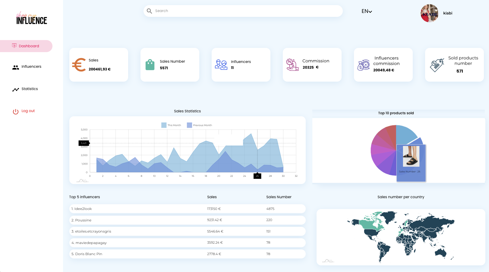

# ShopMyInfluence Challenge Result - FrontEnd

## Overview

This challenge involves building two projects:

1. Node.js Project: Provides APIs to be consumed by the frontend.
2. React.js Project: Implements the dashboard section from the provided design mockup, displaying brand statistics.

The goal is to create a React.js project that integrates with the Firebase project provided: Firebase Console. The application will visualize sales statistics for different brands based on data stored in the database.

# Objectives

- Each sale in the database is associated with a brand and an influencer.
- The route domain/brand/{offerId} should display statistics for the brand associated with the offerId.
- Leverage design patterns and any advanced libraries to enhance the project.
- Implement the chart based on the suggested graphic mockup provided in the challenge.

## Key Features

- A React.js dashboard for visualizing sales statistics.
- API integration using a Node.js backend.
- Dynamic routing to display brand-specific statistics (domain/brand/{offerId}).
- Use of Firebase for database integration.

# Prerequisites

- Node.js (v16 or later recommended)
- npm or yarn
- Firebase account access

# Notes

- The complete description of the challenge can be found in the docs folder (in French).
- Feel free to reach out for any questions or clarifications.
